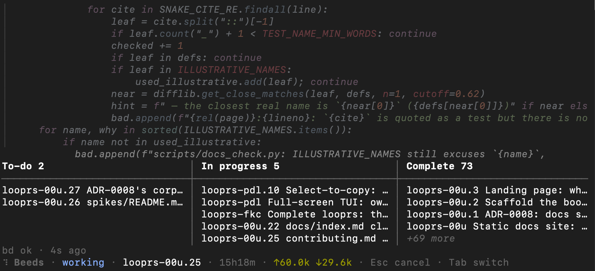
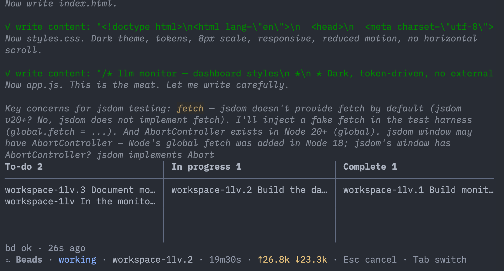

# Personal Harness + Loop

This is a repository with my personal configurations and docker containers for agentic coding.

Example of a long-running session:



Example running in Zed's agent terminal:



## Global configuration

[models.json](./models.json) should go in your .pi/agents directory.  

If you are connecting to any engine that does not parse reasoning into seperate message types, use something like this in your `campat` object: 

```json
"thinkingFormat": "qwen-chat-template",
"thinkingTokenBudgetField": "thinking_budget_tokens"
```

The backend api can be set to openai or anthropic:

```json
"api": "openai-completions", 
```
or
```json
"api":  "anthropic-messages",
```

## Custom Looprs
[looprs](./looprs) is a TUI app that enables my preferred coding workflow. This uses [pi.dev](https://pi.dev) with [beads](https://beads.gascity.com/) to create an organized, long-running, and resilient agent.  I use local LLMs so all agent calls need to be sequential for performance, and this combination fits the bill perfectly.  

[Full docs](https://danielhstahl.github.io/personal-harness/index.html).

The agent follows this state machine:

* State 0: Harness starts.  Go to State 1.
* State 1: Start new session (no persisted context).  Checks for any `beads` in "ready" state.  If yes, go to State 4.  Else, State 2. 
* State 2: Wait for input from human.  On input, go to State 3.
* State 3: Take human input and translate this into one or more `beads`.  Use a `split` tool.  Go to State 1.
* State 4: Start new session (no persisted context).  Select top "ready" `bead` and "claim" it.  Work `bead`.  Go to State 5.
* State 5: "Close" `bead`.  Commit work.  Use `bd remember` to store anything that future agents may need.  Go to State 1.

## Docker image
[docker](./docker) contains the docker file that wraps this agent, and is strongly recommended for isolation.  Use it with the [harness.sh](./docker/harness.sh) shell script or stand-alone with 

```sh
docker run --rm -it \
  -v "$PWD:/workspace" \
  --add-host=host.docker.internal:host-gateway \
  -v $HOME/.pi/agent:/home/appuser/.pi/agent \
  -e GIT_USER_NAME="$GIT_USER_NAME" \
  -e GIT_USER_EMAIL="$GIT_USER_EMAIL" \
  ghcr.io/danielhstahl/pi-beads:$TAG
```
